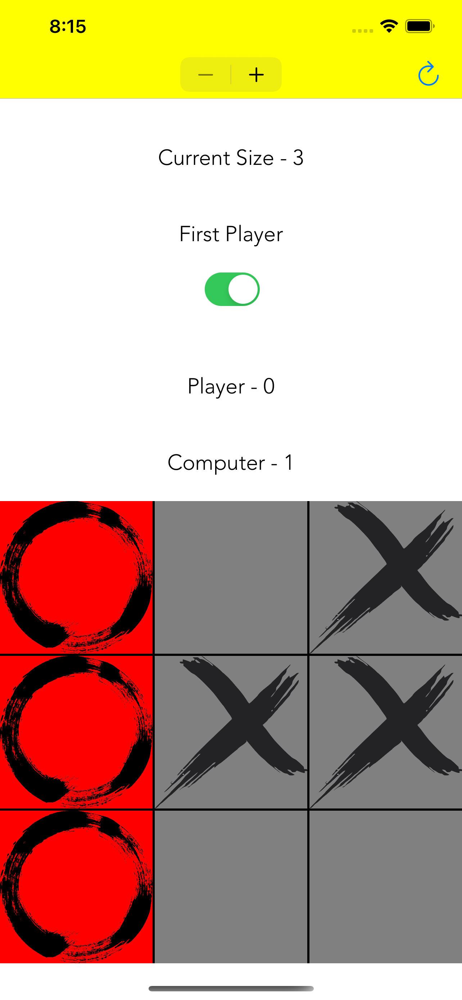

#  TripleT
Tic Tac Toe with custom dimensions

## Features
- Player or computer can start
- Score is recorded
- Highlights win
- Easily change board size
- Restart board
- Splash Screen

## Board Size
It is assumed the board is at least 3 X 3 (you can hack it to be smaller but wont make for a good game).
The maximum board size is 25 X 25. I think the largest I could display on an iPhone Pro was 70 x 70 but the AI will take too long

## How to play
You always play as X, and the computer plays as O. However you can switch between who starts using the toggle switch in the top.

## Tests
Currently there is testing for all win scenarios for both computer and player

## AI
 - First I created a random selection AI
 - After that I upgraded to an AI that first checks for a winning move, then a blocking move, if not makes random move
 - After investigation I looked into miniMax algo for AI however it can be very slow on the first move so it is disabled on any board size greater than 3 (if playing with computer first it is a long time for the computer to make the first move). You can enable/disable the MiniMax AI in the environment variables. I did try re-writing the board (boardTwo file) to hold Ints instead of buttons for the board in hopes that it would run faster but it did not. I did enhance the algorithms I found online to check for winning moves based off of the last move you made and not just ass possible moves.

## Future Improvements
 - More tests
 - Improved AI
 - Animation, nicer assets
 - Use ARKit to play in the real world
 - Settings to change scheme, strength of AI, etc

## Credited Work
UIViewExtensions was an existing file I pulled from another project
A lot of inspiration for MiniMax was found here https://freecontent.manning.com/classic-computer-science-problems-in-swift-tic-tac-toe/
https://www.geeksforgeeks.org/minimax-algorithm-in-game-theory-set-3-tic-tac-toe-ai-finding-optimal-move/
